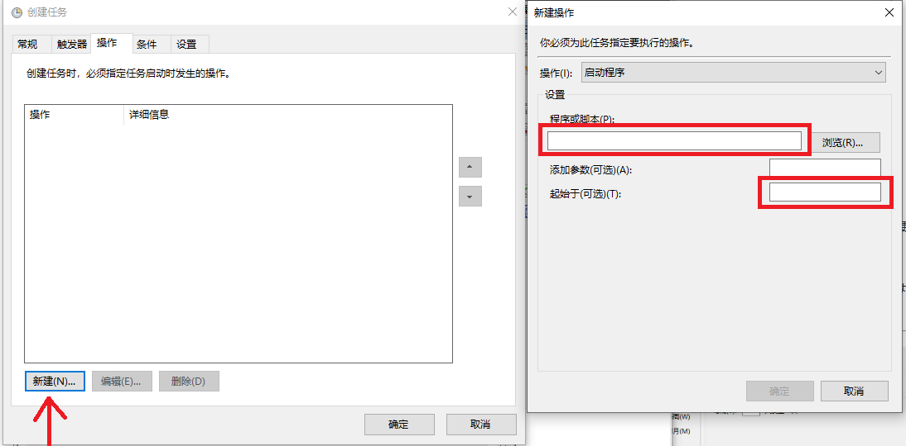

# 健康自动打卡程序 

​    为了避免忘打卡问题，编写一个自动打卡程序，可以实现自动化打卡。

## 依赖

1. Chrome浏览器。要注意chromedriver要与Chrome浏览器的版本一致。程序文件夹内chromedriver.exe匹配的是最新的稳定版: 87.0.4280.88（正式版本）（64 位）如果不一致时，有两种处理方法。
   1. 下载或更新Chrome，确认Chrome的版本也是87.0.4280.88（正式版本）（64 位）
   2. 到 https://chromedriver.chromium.org/downloads 下载与Chorme匹配的chromedriver.exe


## 编辑学号

  路径内的name.json请填入自己的学号和密码，注意将学号和密码填写在引号内。重要。


## 自动执行

​    Windows下的自动执行程序，在计算机或此电脑下，右键点击管理，进入计算机管理界面。


点击左侧任务计划程序，然后出现如下界面，再点击创建一个任务。


在弹出的窗体内，基本上只要填写三个地方：


常规、触发器和操作三个部分。常规这里只要填写一个名称即可，可以随意，但要有一写的辨识性，以便修改。


触发器是指定程序运行的时间。这里先点击新建一个触发器，然后在新界面里选择每天，以便每天可以执行打卡程序 。


最后在操作标签页里，也是新建一个操作。在程序或脚本里，选到nwpu_clock_in.exe的路径，然后在起始于框内填入nwpu_clock_in.exe所在路径，以便程序能找到name.json文件。




# 打包方法

```shell
pyinstaller -F -w nwpu_clock_in.py
```

同时，去除黑框的方法参考： https://www.cnblogs.com/it-tsz/p/10592151.html